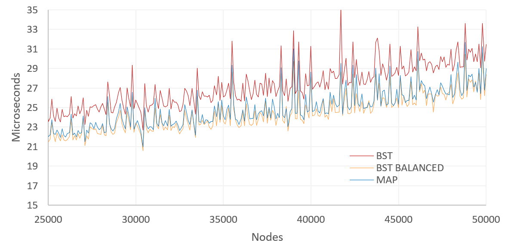

# Advanced Programming Exam

### _Author: Valentina Blasone (1st year DSSC)_
___

## Python Exercise

The solution to the proposed exercise is included in the file `test_exam.py`. The solution fully exploits list comprehensions.
___

## Implementation of a Binary Search Tree

## Overview of the Files

The following files are provided:

+ `c++/bst.hpp` is the main file, containing all the implemantation of the BST

+ `c++/main.cpp` is a an illustrative program that performs tests on the data structure functionalities

+ `c++/benchmark.cpp` is a very simple benchmark program

+ `c++/Makefile` to compile all the source code

+ `README.md` this file, with a short description of how to compile and run the code, a description of the implementation design and finally a short presentation of the benchmark results

## Compile and Run

+ `C++14` has been used

+ To compile all the source files type:
  
  ```bash
  make
  ```

  If some debug information are desired:
  
   ```bash
  make EXTRA_CXXFLAGS=-D__DEBUG
     ```
  
+ To run an illustrative program that performs tests on the data structure functionalities type:

  ```bash
  ./main.x
  ```

+ To run a very simple benchmark test type:

  ```bash
  ./benchmark.x
  ```

+ The code has been run using `valgrind` to test it against memory leaks

## Design

The code consists in three classes: `bst`, `Node` and `Iterator`. The class `Iterator` is declared inside the class `bst`, while the class `Node` is declared outside.

### bst

The class `bst` defines the Binary Search Tree data structures. The class is templated over the key type, `KT`, the value type `VT` and the operation type `OP`. It has three member variables:

+ `op` of type `OP` which stores the desired total order (`std::less` by default)
+ `_size` of type `std::size_t` which stores the number of nodes in the tree
+ `root` of type `std::unique_ptr` which points to the root of the tree

The member functions are all the ones requested by the exercise, with the addition of some auxiliary functions and of an additional function to print the tree in a tree-shape fashion (mostly for checking purposes).

All the nodes are created inside the `bst` class  and the (key, value) pair is of type `std::pair<const KT, VT>`.

### Node

The class `Node` defines the Node data structure, and is essential for defyning the tree. However, it was decided to put it outside because the templates can be different and because it is not necessary to have fixed a total order to define a Node. The class is templated over the "data type", `T`. The class has three member variables:

+ `data` which is of type `T` and represents the data type
+ `parent` which is of type `T*` and points to the parent of the node
+ `left` which is of type `std::unique_ptr` and points to the left child of the node
+ `right` which is of type `std::unique_ptr` and points to the right child of the node

The appropriate custom custructors are defined. Following the design choices (new nodes only defined inside the `bst` class, const key), copy and move semantics are marked `delete`.

### Iterator

The class `Iterator` is templated over the "Node type", `N`. The class has only one member variable:
+ `current_ptr` which is of type `N*` and represents the object currently pointed to by the iterator

The class implements a "forward iterator" and implements all the necessary member functions and operators.


## Illustrative Program

Herein the result that can be obtained by running `main.x` are reported.

```
** RUNNING SOME TESTS ON THE CODE **    

------------------------------------    
- Create and empy tree b1 and print it -

b1, using the put-to operator: 
The tree is empty

b1, using the Print() member function:  
The tree is empty
------------------------------------
- Insert the keys: {8, 3, 10, 1, 6, 4, 7, 14} using l-value insert -

b1, using the put-to operator:
1 3 4 6 7 8 10 14

b1, using the Print() member function:

8
3(8l)  10(8r)
1(3l)  6(3r)  14(10r)
4(6l)  7(6r)

------------------------------------
- Insert the key: {13} using r-value insert -

b1, using the put-to operator:
1 3 4 6 7 8 10 13 14

b1, using the Print() member function:

8
3(8l)  10(8r)
1(3l)  6(3r)  14(10r)
4(6l)  7(6r)  13(14l)

------------------------------------
- Insert the key: {5} using emplace -

b1.emplace(5,5);

b1, using the put-to operator:
1 3 4 5 6 7 8 10 13 14

b1, using the Print() member function:

8
3(8l)  10(8r)
1(3l)  6(3r)  14(10r)
4(6l)  7(6r)  13(14l)
5(4r)

------------------------------------
- Copy constructor -

bst<int,double> b2 {b1};

b2, using the put-to operator:
1 3 4 5 6 7 8 10 13 14

b2, the Print() member function:

8
3(8l)  10(8r)
1(3l)  6(3r)  14(10r)
4(6l)  7(6r)  13(14l)
5(4r)

------------------------------------
- Copy assignment -

Create a tree b3 with keys {6, 4, 1}

b3, using the put-to operator:
1 4 6

b3, using the Print() member function:

6
4(6l)
1(4l)

b3 = b1;

b3, using the put-to operator:
1 3 4 5 6 7 8 10 13 14

b3, using the Print() member function:

8
3(8l)  10(8r)
1(3l)  6(3r)  14(10r)
4(6l)  7(6r)  13(14l)
5(4r)

------------------------------------
- Clear -

b1.clear;

b1, using the put-to operator:
The tree is empty

b1, using the Print() member function:
The tree is empty
------------------------------------
- Balance -

Unbalanced tree b1: {1, 3, 4, 5, 6, 7, 8, 10, 13, 14} -

b1, using the put-to operator:
1 3 4 5 6 7 8 10 13 14

b1, using the Print() member function:

1
3(1r)
4(3r)
5(4r)
6(5r)
7(6r)
8(7r)
10(8r)
13(10r)
14(13r)

b1.balance();

b1, using the put-to operator:
1 3 4 5 6 7 8 10 13 14

b1, using the Print() member function:

7
4(7l)  10(7r)
1(4l)  5(4r)  8(10l)  13(10r)
3(1r)  6(5r)  14(13r)

------------------------------------
- Subscripting operator -

b1[8] = 8

b1[20] = 0

b1, using the put-to operator:
1 3 4 5 6 7 8 10 13 14 20

b1, using the Print() member function:

7
4(7l)  10(7r)
1(4l)  5(4r)  8(10l)  13(10r)
3(1r)  6(5r)  14(13r)
20(14r)

------------------------------------
- Erase -

b1.erase(7);

b1, using the put-to operator:
1 3 4 5 6 8 10 13 14 20

b1, using the Print() member function:

8
4(8l)  10(8r)
1(4l)  5(4r)  13(10r)
3(1r)  6(5r)  14(13r)
20(14r)

b1.erase(8);

b1, using the put-to operator:
1 3 4 5 6 10 13 14 20

b1, using the Print() member function:

10
4(10l)  13(10r)
1(4l)  5(4r)  14(13r)
3(1r)  6(5r)  20(14r)

------------------------------------
- Find -

b1.find(5);

The returned iterator points to: 5
```

## Simple Benchmark

A simple benchmark is performed, by comparing the `bst` implementation, un-balanced and balanced, with the `std::map` implementation. The benchmark is performed on the `find` member function.

For a given number of nodes, `nodes`, an array containing the numbers `1, 2, ..., nodes` is first created. The array is then randomly re-shuffled and the nodes are inserted in all the data structures using the member function `emplace`. For this illustrative example the values are taken equal to the corresponding key. One `bst` is then balanced, the other one is left un-balanced. The array is again re-shuffled and then the `find` function is called for a number of keys equal to the 20% of the nodes number (the keys are taken as the first elements in the random array). For every number of nodes the process is repeated 50 times and the mean values are considered.

The results obtained are shown in the following picture. We can see that the balanced bst and the map data structures perform very similarly.





